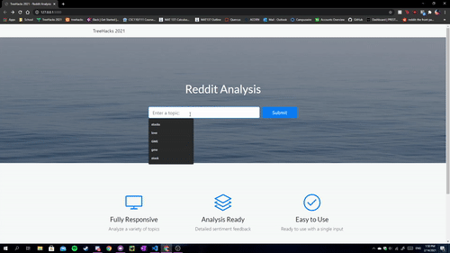

# Reddit Analysis
[TreeHacks 2021]
 
 ## Inspiration
After the recent Gamestop GME stock situation, we were inspired to create a software algorithm that helps consumers and businesses detect grassroots market trends through analyzing Reddit posts. 

We wanted to explore different social media APIs, so we decided to use the Reddit API as there was a python API wrapper available at our convenience. 

## What it does
The program asks the user to input a specific topic or keyword. It then searches through about 1,000 Reddit posts with that corresponding keyword. It then outputs the market popularity of that topic. It also outputs consumer sentiment towards that topic, from negative to positive expressed as a percentage.  

## How we built it
We used Flask to establish a back-end server and API to receive user input then use our processing algorithms to return the relevant data. The PRAW reddit API wrapper for python allowed us to retrieve post data from reddit. 

## Challenges we ran into
Our most significant difficulty was navigating the discontinuity between the font and the back end. We had trouble connecting the two codes, and that obstacle almost ended our project. Luckily, we ended up using the Flask API, which solved this problem.

## Accomplishments that we're proud of
We created a comprehensive back-end software that incorporates fascinating computer science concepts such as sentiment analysis. As first-year computer science students who have never gone to a hackathon before, this project was very empowering. It showed us that we could create something meaningful if we were resilient and focused. 

## What we learned
We learned that front-end design is an entire world on its own, and it should not be neglected. We spent most of the hackathon coding the back-end of our project and ensuring that the algorithm was functioning correctly. However, we could not create a visually appealing user interface, which meant that our comprehensive algorithm was ultimately scarred by the flawed front-end.

## What's next for Reddit Analysis 
We will need to create a user-friendly front-end, so the program is accessible for the average individual.
Furthermore, we would need to find a way to cut down on our program's processing times. It takes about five seconds for the program to calculate the results, which is inconvenient for the user.
Lastly, we need to find an online webserver to host our program so the community can use it. 

### Demo:

